[](benchmarks/README.md)
[](BEST_PRACTICES.md)
[](CHANGELOG.md)
[](CONTRIBUTING.md)
[](examples/)
[](FAQ.md)
[](https://opensource.org/licenses/Apache-2.0)
[](ROADMAP.md)

# elkodon - Zero-Copy Lock-Free IPC Purely Written In Rust

 1. [Introduction](#introduction)
 2. [Performance](#performance)
 3. [Getting Started](#getting-started)
    1. [Publish Subscribe](#publish-subscribe)
    2. [Events](#events)
    3. [Custom Configuration](#custom-configuration)
 4. [Supported Platforms](#supported-platforms)
 5. [Language Bindings](#language-bindings)
 6. [Thanks To All Contributors](#thanks-to-all-contributors)

## Introduction

Welcome to Elkodon, the efficient, and ultra-low latency inter-process communication
middleware. This library is designed to provide you with fast and reliable
zero-copy and lock-free inter-process communication mechanisms.

Elkodon is all about providing a seamless experience for inter-process
communication, featuring versatile messaging patterns. Whether you're diving
into publish-subscribe, events, or the promise of upcoming features like
request-response, pipelines, and blackboard, Elkodon has you covered.

One of the features of Elkodon is its consistently low transmission latency
regardless of payload size, ensuring a predictable and reliable
communication experience.

Elkodon's origins can be traced back to
[iceoryx](https://github.com/eclipse-iceoryx/iceoryx). By overcoming past
technical debts and refining the architecture, Elkodon enables the modularity
we've always desired.

In the near future, Elkodon is poised to support at least the same feature set
and platforms as [iceoryx](https://github.com/eclipse-iceoryx/iceoryx),
ensuring a seamless transition and offering enhanced
capabilities for your inter-process communication needs. So, if you're looking
for lightning-fast, cross-platform communication that doesn't compromise on
performance or modularity, Elkodon is your answer.

## Performance

```mermaid
gantt
    title Latency (in ns) - 64b payload
    dateFormat X
    axisFormat %s

    section elkodon
    240 : 0, 240
    section iceoryx
    1000 : 0, 1000
    section MQueue
    700 : 0, 700
    section UDS
    1500 : 0, 1500
```

```mermaid
gantt
    title Latency (in ns) - 64kb payload
    dateFormat X
    axisFormat %s

    section elkodon
    240 : 0, 240
    section iceoryx
    1000 : 0, 1000
    section MQueue
    14000 : 0, 14000
    section UDS
    23000 : 0, 23000
```





**Benchmark-System**

- **CPU:** Intel(R) Core(TM) i7-10875H CPU @ 2.30GHz
- **OS:** Linux 6.5.9-arch2-1 #1 SMP PREEMPT_DYNAMIC GNU/Linux
- **Compiler:**
  - rustc 1.72.1
  - gcc 13.2.1 20230801

## Getting Started

### Publish Subscribe

This minimal example showcases a publisher sending the number 1234 every second,
while a subscriber efficiently receives and prints the data.

**publisher.rs**

```rust
use elkodon::prelude::*;
use elkodon_bb_posix::signal::SignalHandler;

fn main() -> Result<(), Box<dyn std::error::Error>> {
    let service_name = ServiceName::new(b"My/Funk/ServiceName")?;

    let service = zero_copy::Service::new(&service_name)
        .publish_subscribe()
        .open_or_create::<usize>()?;

    let publisher = service.publisher().create()?;

    while !SignalHandler::termination_requested() {
        let mut sample = publisher.loan_uninit()?;
        sample.payload_mut().write(1234);
        let sample = unsafe {
            sample.assume_init()
        }
        publisher.send(sample)?;

        std::thread::sleep(std::time::Duration::from_secs(1));
    }

    Ok(())
}
```

**subscriber.rs**

```rust
use elkodon::prelude::*;
use elkodon_bb_posix::signal::SignalHandler;

fn main() -> Result<(), Box<dyn std::error::Error>> {
    let service_name = ServiceName::new(b"My/Funk/ServiceName")?;

    let service = zero_copy::Service::new(&service_name)
        .publish_subscribe()
        .open_or_create::<usize>()?;

    let subscriber = service.subscriber().create()?;

    while !SignalHandler::termination_requested() {
        while let Some(sample) = subscriber.receive()? {
            println!("received: {:?}", *sample);
        }

        std::thread::sleep(std::time::Duration::from_secs(1));
    }

    Ok(())
}
```

This example is a simplified version of the
[publish-subscribe example](examples/examples/publish_subscribe/). You can
execute it by opening two terminals and calling:

**Terminal 1:**

```sh
cargo run --example publish_subscribe_publisher
```

**Terminal 2:**

```sh
cargo run --example publish_subscribe_subscriber
```

### Events

This minimal example showcases an event notification between two processes.

**notifier.rs**

```rust
use elkodon::prelude::*;
use elkodon_bb_posix::signal::SignalHandler;

fn main() -> Result<(), Box<dyn std::error::Error>> {
    let event_name = ServiceName::new(b"MyEventName")?;

    let event = zero_copy::Service::new(&event_name)
        .event()
        .open_or_create()?;

    let notifier = event.notifier().create()?;

    let mut counter: u64 = 0;
    while !SignalHandler::termination_requested() {
        counter += 1;
        notifier.notify_with_custom_event_id(EventId::new(counter))?;

        println!("Trigger event with id {} ...", counter);
        std::thread::sleep(std::time::Duration::from_secs(1));
    }

    Ok(())
}
```

**listener.rs**

```rust
use elkodon::prelude::*;
use elkodon_bb_posix::signal::SignalHandler;

fn main() -> Result<(), Box<dyn std::error::Error>> {
    let event_name = ServiceName::new(b"MyEventName")?;

    let event = zero_copy::Service::new(&event_name)
        .event()
        .open_or_create()?;

    let mut listener = event.listener().create()?;

    while !SignalHandler::termination_requested() {
        for event_id in listener.timed_wait(std::time::Duration::from_secs(1))? {
            println!("event was triggered with id: {:?}", event_id);
        }
    }

    Ok(())
}
```

This example is a simplified version of the
[event example](examples/examples/event/). You can
execute it by opening two terminals and calling:

**Terminal 1:**

```sh
cargo run --example event_notifier
```

**Terminal 2:**

```sh
cargo run --example event_listener
```

### Custom Configuration

It is possible to configure default quality of service settings, paths and file suffixes in a
custom configuration file. For more details visit the [configuration directory](config/).

## Supported Platforms

The support levels can be adjusted when required.

| Operating System | State        | Current Support Level | Target Support Level |
|------------------|:-------------|:---------------------:|---------------------:|
| Android          | planned      | -                     | tier 1               |
| FreeBSD          | done         | tier 2                | tier 1               |
| FreeRTOS         | planned      | -                     | tier 2               |
| iOS              | planned      | -                     | tier 2               |
| Linux (x86_64)   | done         | tier 2                | tier 1               |
| Linux (aarch64)  | done         | tier 2                | tier 1               |
| Linux (32-bit)   | in-progress  | tier 3                | tier 1               |
| Mac OS           | in-progress  | tier 3                | tier 2               |
| QNX              | planned      | -                     | tier 1               |
| WatchOS          | planned      | -                     | tier 2               |
| Windows          | done         | tier 2                | tier 2               |

- **tier 1** - All safety and security features are working.
- **tier 2** - Works with a restricted security and safety feature set.
- **tier 3** - Work in progress. Might compile and run or not.

## Language Bindings

| Language | State    |
|----------|---------:|
| C / C++  | planned  |
| Lua      | planned  |
| Python   | planned  |
| Zig      | planned  |

## Thanks To All Contributors

<!-- prettier-ignore-start -->
<!-- markdownlint-disable -->

<table>
  <tbody>
    <tr>
      <td align="center" valign="top" width="14.28%">
          <a href="https://github.com/elfenpiff">
          <br />
          <sub><b>Christian »elfenpiff« Eltzschig</b></sub></a></td>
      <td align="center" valign="top" width="14.28%">
          <a href="https://github.com/elboberido">
          <br />
          <sub><b>Mathias »elBoberido« Kraus</b></sub></a></td>
    </tr>
  </tbody>
</table>

<!-- markdownlint-restore -->
<!-- prettier-ignore-end -->
