# elkodon - Zero-Copy Lock-Free IPC Purely Written In Rust

| [benchmarks](benchmarks/README.md) | [changelog](CHANGELOG.md) | [contributing](CONTRIBUTING.md) | [examples](examples/README.md) | [faq](FAQ.md) | [roadmap](ROADMAP.md) |

 1. [Introduction](#introduction)
 2. [Performance](#performance)
 3. [Getting Started](#getting-started)
    1. [Publish Subscribe](#publish-subscribe)
    2. [Events](#events)
 4. [Supported Platforms](#supported-platforms)
 5. [Language Bindings](#language-bindings)
 6. [Thanks To All Contributors](#thanks-to-all-contributors)

## Introduction

Welcome to Elkodon, your gateway to fast, efficient, and ultra-low latency
inter-process communication. This library is the embodiment of Rust's power and
elegance, designed to meet your communication needs with zero-copy and lock-free
mechanisms.

Elkodon is all about providing a seamless experience for inter-process
communication, featuring versatile messaging patterns. Whether you're diving
into publish-subscribe, events, or the promise of upcoming features like
request-response, pipelines, and blackboard, Elkodon has you covered.

One of the standout features of Elkodon is its remarkable consistency.
Regardless of payload size, transmission latency remains constant, ensuring a
predictable and reliable communication experience.

Elkodon's origins can be traced back to Iceoryx, but it's not just an
evolution – it's a revolution. By overcoming past technical debts and refining
the architecture, Elkodon enables the modularity we've always desired.

In the near future, Elkodon is poised to support at least the same feature set
and platforms as Iceoryx, ensuring a seamless transition and offering enhanced
capabilities for your inter-process communication needs. So, if you're looking
for lightning-fast, cross-platform communication that doesn't compromise on
performance or modularity, Elkodon is your answer. Welcome to a new era of
inter-process communication.

## Performance

```mermaid
gantt
    title Latency (in ns) - 64b payload
    dateFormat X
    axisFormat %s

    section elkodon
    240 : 0, 240
    section iceoryx
    1000 : 0, 1000
    section MQueue
    700 : 0, 700
    section UDS
    1500 : 0, 1500
```

```mermaid
gantt
    title Latency (in ns) - 64kb payload
    dateFormat X
    axisFormat %s

    section elkodon
    240 : 0, 240
    section iceoryx
    1000 : 0, 1000
    section MQueue
    14000 : 0, 14000
    section UDS
    23000 : 0, 23000
```





**Benchmark-System**

- **CPU:** Intel(R) Core(TM) i7-10875H CPU @ 2.30GHz
- **OS:** Linux 6.5.9-arch2-1 #1 SMP PREEMPT_DYNAMIC GNU/Linux
- **Compiler:**
  - rustc 1.72.1
  - gcc 13.2.1 20230801

## Getting Started

### Publish Subscribe

This minimal example showcases a publisher sending the number 1234 every second,
while a subscriber efficiently receives and prints the data.

**publisher.rs**

```rust
use elkodon::prelude::*;
use elkodon_bb_posix::signal::SignalHandler;

fn main() {
    let service_name = ServiceName::new(b"My/Funk/ServiceName").unwrap();

    let service = zero_copy::Service::new(&service_name)
        .publish_subscribe()
        .open_or_create::<usize>()
        .expect("failed to create/open service");

    let publisher = service
        .publisher()
        .create()
        .expect("failed to create publisher");

    while !SignalHandler::was_ctrl_c_pressed() {
        let mut sample = publisher.loan().expect("Failed to acquire sample");
        unsafe { sample.write(1234); }
        publisher.send(sample).expect("Failed to send sample");

        std::thread::sleep(std::time::Duration::from_secs(1));
    }
}

```

**subscriber.rs**

```rust
use elkodon::prelude::*;
use elkodon_bb_posix::signal::SignalHandler;

fn main() {
    let service_name = ServiceName::new(b"My/Funk/ServiceName").unwrap();

    let service = zero_copy::Service::new(&service_name)
        .publish_subscribe()
        .open_or_create::<TransmissionData>()
        .expect("failed to create/open service");

    let subscriber = service
        .subscriber()
        .create()
        .expect("Failed to create subscriber");

    while !SignalHandler::was_ctrl_c_pressed() {
        while let Some(sample) = subscriber.receive().unwrap() {
            println!("received: {:?}", *sample);
        }

        std::thread::sleep(std::time::Duration::from_secs(1));
    }
}
```

This example is a simplified version of the
[publish-subscribe example](examples/examples/publish_subscribe/). You can
execute it by opening two terminals and calling:

**Terminal 1:**

```sh
cargo run --example publish_subscribe_publisher
```

**Terminal 2:**

```sh
cargo run --example publish_subscribe_subscriber
```

### Events

This minimal example showcases an event notification between two processes.

**notifier.rs**

```rust
use elkodon::prelude::*;
use elkodon_bb_posix::signal::SignalHandler;

fn main() {
    let event_name = ServiceName::new(b"MyEventName").unwrap();

    let event = zero_copy::Service::new(&event_name)
        .event()
        .open_or_create()
        .expect("failed to create/open event");

    let notifier = event
        .notifier()
        .create()
        .expect("failed to create notifier");

    let mut counter: u64 = 0;
    while !SignalHandler::was_ctrl_c_pressed() {
        counter += 1;
        notifier
            .notify_with_custom_trigger_id(EventId::new(counter))
            .expect("failed to trigger event");

        println!("Trigger event with id {} ...", counter);
        std::thread::sleep(std::time::Duration::from_secs(1));
    }
}
```

**listener.rs**

```rust
use elkodon::prelude::*;
use elkodon_bb_posix::signal::SignalHandler;

fn main() {
    let event_name = ServiceName::new(b"MyEventName").unwrap();

    let event = zero_copy::Service::new(&event_name)
        .event()
        .open_or_create()
        .expect("failed to create/open event");

    let mut listener = event
        .listener()
        .create()
        .expect("failed to create listener");

    while !SignalHandler::was_ctrl_c_pressed() {
        for event_id in listener
            .timed_wait(std::time::Duration::from_secs(1))
            .expect("failed to wait on listener")
        {
            println!("event was triggered with id: {:?}", event_id);
        }
    }
}
```

This example is a simplified version of the
[event example](examples/examples/event/). You can
execute it by opening two terminals and calling:

**Terminal 1:**

```sh
cargo run --example event_notifier
```

**Terminal 2:**

```sh
cargo run --example event_listener
```

## Supported Platforms

| Operating System | State       | Support Level |
|------------------|:-----------:|--------------:|
| Android          | planned     | open          |
| FreeBSD          | implemented | target        |
| FreeRTOS         | planned     | target        |
| iOS              | planned     | open          |
| Linux (x86_64)   | implemented | target        |
| Linux (aarch64)  | implemented | target        |
| Linux (32-bit)   | in-progress | target        |
| Mac OS           | in-progress | development   |
| QNX              | planned     | target        |
| WatchOS          | planned     | open          |
| Windows          | implemented | development   |

- **development** - Works with a restricted security and safety feature set.
- **target** - All safety and security features are working.
- **open** - Support level is undecided.

## Language Bindings

| Language | State    |
|----------|---------:|
| C / C++  | planned  |
| Lua      | planned  |
| Python   | planned  |
| Zig      | planned  |

## Thanks To All Contributors

<!-- prettier-ignore-start -->
<!-- markdownlint-disable -->

<table>
  <tbody>
    <tr>
      <td align="center" valign="top" width="14.28%">
          <a href="https://github.com/elfenpiff">
          <br />
          <sub><b>Christian »elfenpiff« Eltzschig</b></sub></a></td>
      <td align="center" valign="top" width="14.28%">
          <a href="https://github.com/elboberido">
          <br />
          <sub><b>Mathias »elBoberido« Kraus</b></sub></a></td>
    </tr>
  </tbody>
</table>

<!-- markdownlint-restore -->
<!-- prettier-ignore-end -->
