# elkodon - Zero-Copy Lock-Free IPC Purely Written In Rust

- add social media links here, gitter, bi weekly iceoryx developer meetup maybe

 1. [Introduction](#introduction)
 2. [Performance](#performance)
 3. [Links](#links)
 4. [Getting Started](#getting-started)
    1. [Publish Subscribe](#publish-subscribe)
    2. [Events](#events)
 5. [Supported Platforms](#supported-platforms)
 6. [Thanks To All Contributors](#thanks-to-all-contributors)

## Introduction

- problems with inter process communication - too many copies
- zero copy is the solution
- goal, embedded safety certified code
- link to roadmap, contribution, code of conduct, faq, maintainer

## Performance

```mermaid
gantt
    title Latency (in nanoseconds) - 64b payload
    dateFormat X
    axisFormat %s

    section elkodon
    240 : 0, 240
    section iceoryx
    1000 : 0, 1000
    section MQueue
    700 : 0, 700
    section UDS
    1500 : 0, 1500
```

```mermaid
gantt
    title Latency (in nanoseconds) - 64kb payload
    dateFormat X
    axisFormat %s

    section elkodon
    240 : 0, 240
    section iceoryx
    1000 : 0, 1000
    section POSIX MessageQueue
    14000 : 0, 14000
    section UnixDomainSockets
    23000 : 0, 23000
```

**Benchmark-System**

- **CPU:** Intel(R) Core(TM) i7-10875H CPU @ 2.30GHz
- **OS:** Linux 6.5.9-arch2-1 #1 SMP PREEMPT_DYNAMIC GNU/Linux
- **Compiler:**
  - rustc 1.72.1
  - gcc 13.2.1 20230801

## Links

- [benchmarks](benchmarks/README.md)
- [changelog](CHANGELOG.md)
- [contributing](CONTRIBUTING.md)
- [examples](examples/README.md)
- [roadmap](ROADMAP.md)

## Getting Started

### Publish Subscribe

### Events

## Supported Platforms

## Thanks To All Contributors

<!-- prettier-ignore-start -->
<!-- markdownlint-disable -->

<table>
  <tbody>
    <tr>
      <td align="center" valign="top" width="14.28%">
          <a href="https://github.com/elfenpiff">
           
          <b>Christian »elfenpiff« Eltzschig</b></a></td>
      <td align="center" valign="top" width="14.28%">
          <a href="https://github.com/elboberido">
           
          <b>Mathias »elBoberido« Kraus</b></a></td>
    </tr>
  </tbody>
</table>

<!-- markdownlint-restore -->
<!-- prettier-ignore-end -->
